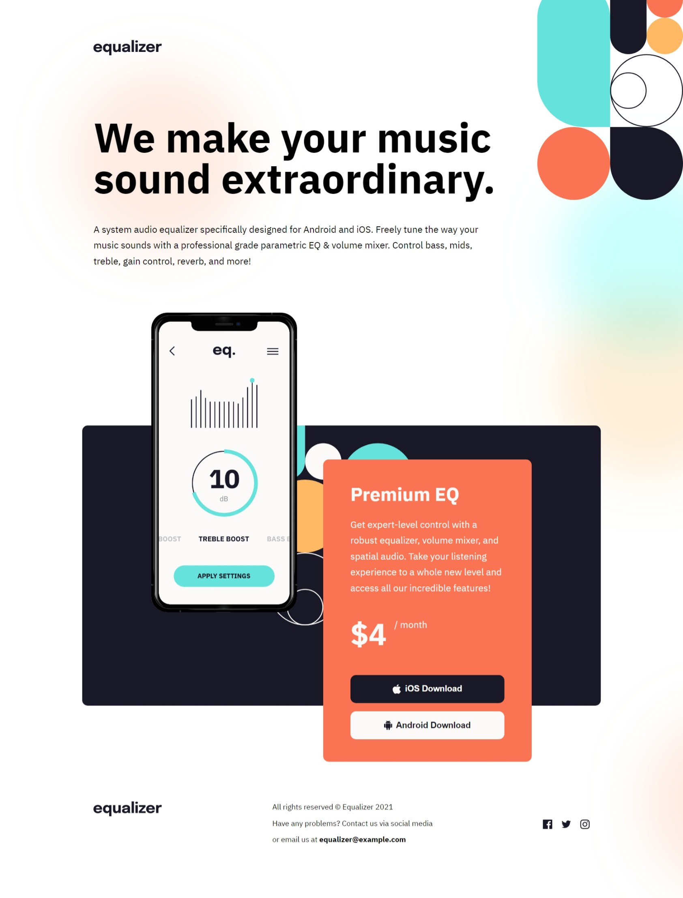

# Frontend Mentor - Equalizer landing page solution

This is a solution to the [Equalizer landing page challenge on Frontend Mentor](https://www.frontendmentor.io/challenges/equalizer-landing-page-7VJ4gp3DE). Frontend Mentor challenges help you improve your coding skills by building realistic projects. 

## Table of contents

- [Overview](#overview)
  - [The challenge](#the-challenge)
  - [Screenshot](#screenshot)
  - [Links](#links)
- [My process](#my-process)
  - [Built with](#built-with)
  - [What I learned](#what-i-learned)
- [Author](#author)

## Overview

### The challenge

Users should be able to:

- View the optimal layout depending on their device's screen size
- See hover states for interactive elements

### Screenshot



### Links

- Solution URL: [Frontend Mentor Solution Page](https://www.frontendmentor.io/solutions/responsive-mobile-app-landing-page-with-tricky-element-positioning-w2whUQvRmM)
- Live Site URL: [Hosted on GitHub Pages](https://aleknovkovski.github.io/FEM-skilled-equalizer-landing-page/working/)

## My process

### Built with

- Semantic HTML5 markup
- CSS custom properties
- Flexbox

### What I learned

As the project involves lots of tricky positioning, I expected to run into issues, however everything was easily solved with standard techniques. 

The one gotcha I encountered was that we need to change the color of an external SVG on hover. Thanks to this, I learned that you can use css filters to create a color-change for an external SVG. 

This is useful if you're referencing an external svg file inside an < img > tag and cannot change its fill or color. In this project I used the filter to turn the social media icons red on hover, like so:

```css
.social-icons img:hover {
    filter: 
      invert(0.4) 
      sepia(1) 
      saturate(20) 
      hue-rotate(259.2deg) 
      brightness(1);
}
```

## Author

- Frontend Mentor - [@aleknovkovski](https://www.frontendmentor.io/profile/aleknovkovski)
- Linkedin - [@aleknovkovski](https://www.linkedin.com/in/aleknovkovski/)
